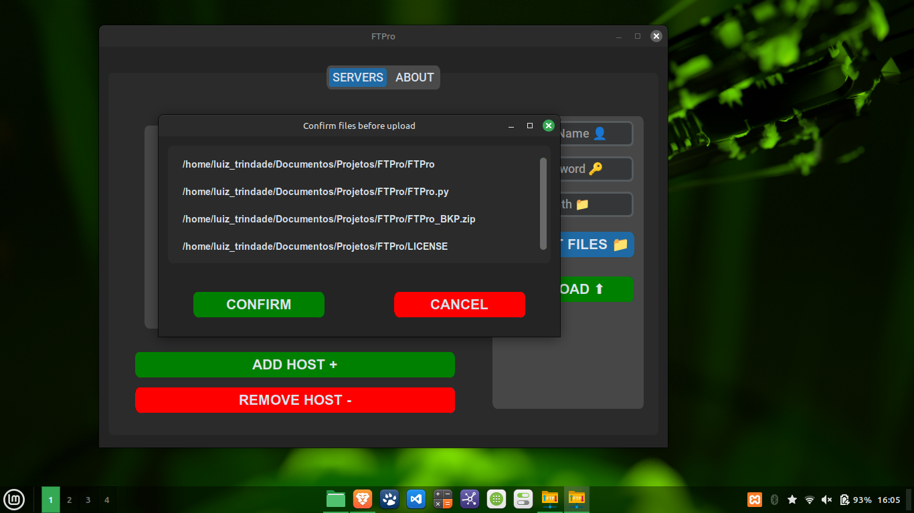

# FTPro

FTPro é um programa que facilita o upload de vários arquivos para múltiplos servidores via FTP.

## Descrição

FTPro é uma aplicação simples, desenvolvida em Python, para automatizar o processo de envio de arquivos para servidores FTP. Através de uma interface amigável, o usuário pode selecionar arquivos localmente e enviá-los simultaneamente para vários servidores cadastrados no programa.

## Funcionalidades

- Upload de múltiplos arquivos para múltiplos servidores via FTP.
- Interface gráfica simples e intuitiva usando `customtkinter`.
- Gerenciamento de servidores FTP (adicionar e remover servidores).
- Confirmar arquivos selecionados antes do envio.
- Exibe mensagens de erro ou sucesso através de janelas de alerta.

## Screenshots





## Instalação

1. Clone o repositório:

    ```bash
    git clone https://github.com/usuario/ftpro.git
    ```

2. Instale as dependências:

    ```bash
    pip install customtkinter ftputil
    ```

3. Execute o programa:

    ```bash
    python ftpro.py
    ```

## Dependências

- Python 3.x
- Bibliotecas:
  - `customtkinter`
  - `ftputil`
  - `sqlite3`

## Licença

Este projeto está licenciado sob a Licença MIT - veja o arquivo [LICENSE](https://mit-license.org/) para mais detalhes.

## Autor

Criado por: Luiz Gabriel Magalhães Trindade.

Copyright © 2024 Luiz Gabriel Magalhães Trindade

